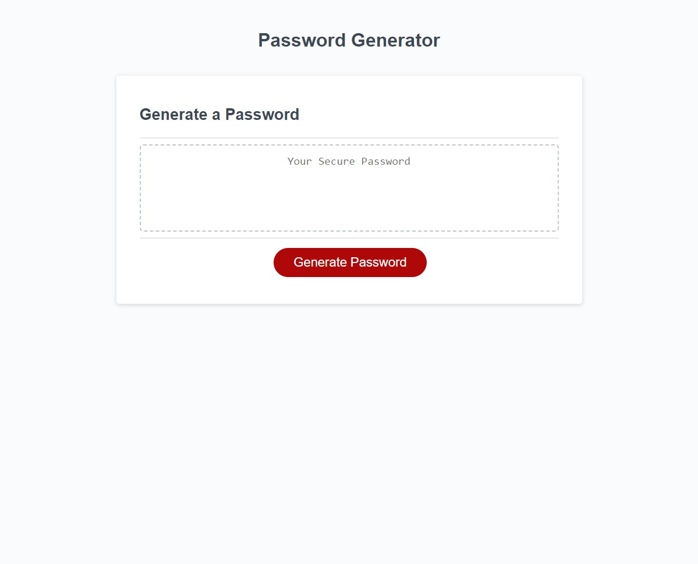

# Password Generator

This is a simple password generator web app that allows the user to generate a new, secure password by selecting various criteria. The app was built using HTML, CSS, and JavaScript.

## Getting Started

To view the website you can visit the website at https://christopherflores9312.github.io/password-generator/

## Usage

To use the password generator, simply click the "Generate Password" button. This will prompt you to select the length of the password (between 8 and 128 characters) and which types of characters to include (lowercase, uppercase, numeric, and/or special characters). You must select at least one type of character to include in the password.

Once you have selected your criteria, the app will generate a random password that meets your specifications and display it in the text area below the button.

## Files

The project includes the following files:

- `index.html`: The main HTML file for the project.
- `style.css`: The CSS stylesheet for the project.
- `script.js`: The JavaScript file for the project.

## License

This project is licensed under the MIT License. See the LICENSE file for more information.
